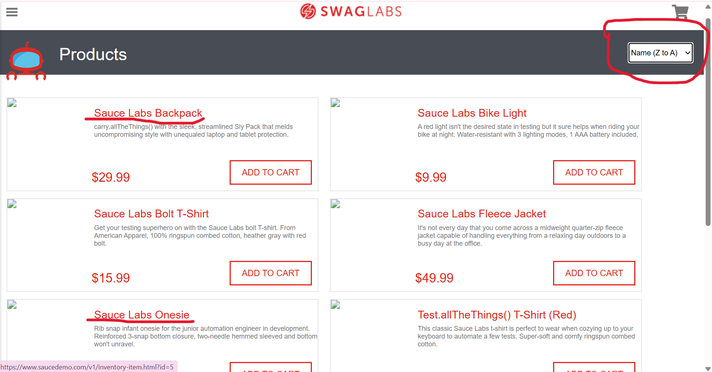

### DEFECT REPORT: High Severity

**Title:** [High] Product Filtering Is Ineffective (All Options)  
**Severity:** High 
**Status:** Open 
**Component/Module:** Inventory Page - Filter Feature 
**Environment:** Chrome Version 141.0.7390.77 (64-bit) 

---
#### 1. Steps to Reproduce (STR):
1.  Navigate to the Inventory Page (after login).
2.  Click the Filter Icon (dropdown menu).
3.  Select any filter option (e.g., Name A-Z, Name Z-A, Price Low-High, or Price High-Low).

#### 2. Expected Result:
The product list should reorder immediately based on the selected filter (e.g., if 'Name A-Z' is selected, the first item name starts with 'A').

#### 3. Actual Result:
The product list remains in its original default order, and products are not sorted according to the selected filter (Name A-Z/Z-A/Price Low-High/High-Low).

#### Attachment
 
[Screenshot Error](Defect_ReportsBug_Filter_Price.png) 
