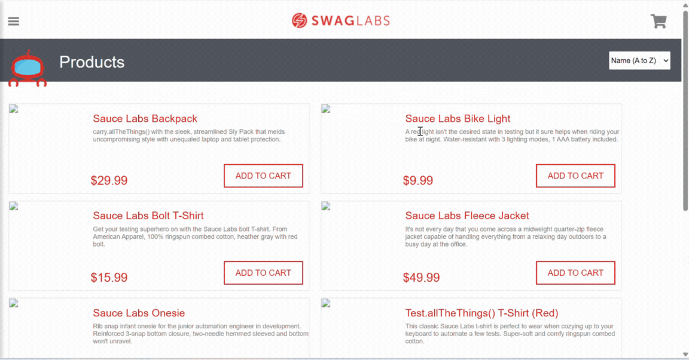

### DEFECT REPORT: High Severity

**Title:** [High] Cart Validation Bypass: Able to Proceed to Checkout with Empty Cart  
**Severity:** High  
**Status:** Open  
**Component/Module:** Shopping Cart / Checkout Button  
**Environment:** Chrome Version 141.0.7390.77 (64-bit)  

---
#### 1. Steps to Reproduce (STR):
1.  Navigate to the Inventory Page (after login).
2.  Click the Shopping Cart icon (top right).
3.  Click the "Checkout" button without adding any items to the cart.

#### 2. Expected Result:
The system should display a clear error message (e.g., "Please add items to your cart before proceeding") and prevent navigation to the payment process.

#### 3. Actual Result:
The system bypasses the validation and proceeds directly to the "Checkout: Your Information" page, despite the cart being empty.

#### Attachment:

